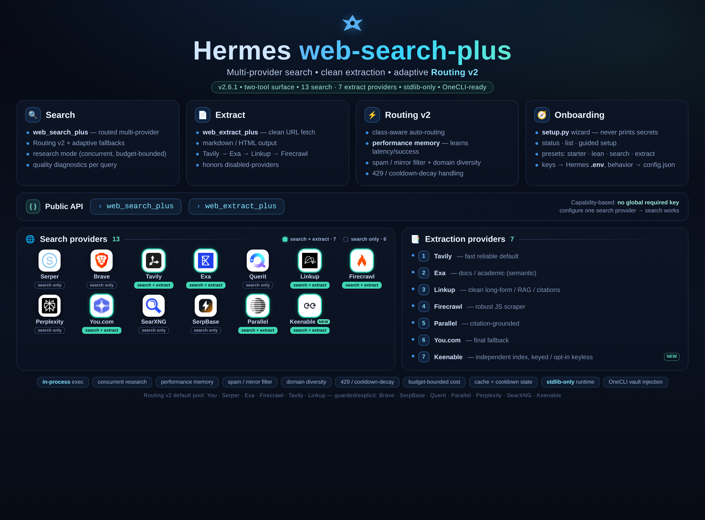

# web-search-plus — Hermes Plugin


<p align="center">
  
</p>

<p align="center">
  <a href="LICENSE"></a>
  
  
</p>

**Web Search Plus is the operator-grade web layer for Hermes: one search tool, one extraction tool, many providers, conservative routing, safe large-page handling, freshness controls, and provider benchmarking without locking you into a single API.** Routing v2 spans 14 search providers and 7 extraction-capable providers; `web_extract_plus(provider="auto")` defaults to Tavily-first extraction for fast, reliable fetches, with Exa, Linkup, Firecrawl, Parallel, and You.com as fallback paths when available.

`web-search-plus` adds two Hermes tools:

- `web_search_plus` — routed multi-provider web search with quality diagnostics
- `web_extract_plus` — clean URL extraction via provider backends

> Ported from [web-search-plus-plugin](https://github.com/robbyczgw-cla/web-search-plus-plugin) for the [Hermes Agent](https://github.com/NousResearch/hermes-agent) plugin API.

---

## Why this exists

Most web-search tools fail in one of two boring ways: they hard-code a single provider, or they pretend every user has every API key. Web Search Plus is capability-based instead: it lets Hermes search, extract, compare, and recover across the providers you actually configured.

- **No global required key.** Configure one search-capable provider and search works.
- **Extraction is additive.** Add Linkup, Firecrawl, Tavily, Exa, Parallel, or You.com for URL extraction.
- **Routing v2 is conservative.** You.com, Serper, Exa, Firecrawl, Tavily, and Linkup form the default search pool; Brave, SerpBase, Querit, Parallel, and Perplexity/Kilo stay explicit/guarded unless opted in.
- **Large pages stay usable.** Long extracts return a compact head/tail preview plus a `read_file` footer for the full cleaned text, instead of dumping token bombs into the agent context.
- **Freshness is explicit.** Ask for day/week/month/year recency once; providers that support native date filters receive the right value, and unsupported providers report that freshness was not applied.
- **Provider quality is measurable.** The built-in bench command compares configured providers on success rate, latency, result volume, URL diversity, and snippet coverage, then suggests a provider-priority order without writing config automatically.
- **Costs and safety stay bounded.** Research mode caps provider work and keeps partial results when extraction fails. Extraction target URLs are guarded before provider dispatch so local/private networks are not fetched by accident.

---

## Quick Start

```bash
# 1) Install and enable the Hermes plugin
hermes plugins install robbyczgw-cla/hermes-web-search-plus --enable

# 2) Configure provider keys with the standalone setup wizard
python ~/.hermes/plugins/web-search-plus/setup.py status
python ~/.hermes/plugins/web-search-plus/setup.py setup

# Bare setup prompts every supported provider; press Enter to skip what you do not have.
# Fast starter preset if you want the short path:
# python ~/.hermes/plugins/web-search-plus/setup.py setup --preset starter
# YOU_API_KEY=...      # fast Routing v2 core provider
# SERPER_API_KEY=...   # reliable Google-like fallback
# LINKUP_API_KEY=...   # clean extraction

# 3) Restart/reload Hermes so plugin tools are registered
# CLI: exit and start `hermes` again, or use /reset in-session
# Gateway/Telegram: /restart, then /reset

# 4) Optional shell smoke test
cd ~/.hermes/plugins/web-search-plus
python3 search.py --query "Hermes Agent latest release" --provider auto --quality-report

# 5) Optional Hermes fast-path check
python ~/.hermes/plugins/web-search-plus/setup.py fastpath
```

Notes:

- Plugin install clones into `~/.hermes/plugins/web-search-plus`.
- Keys are written to the active Hermes environment file by the setup helper; they should never be committed to the repo.
- Python 3.8+ is required. Runtime code is stdlib-only; manual development can still run `python3 -m pip install -r requirements.txt` safely before installing dev tools like `pytest` and `ruff`.

### Fast-path performance setup

Web Search Plus is most reliably routed when Hermes can call `web_search_plus` and `web_extract_plus` as registered plugin tools instead of falling back to legacy web tools. This feature intentionally targets **current public Hermes behavior** and does not require local Hermes core patches.

Recommended current-Hermes config:

```yaml
agent:
  disabled_toolsets: [web]
```

That keeps the old built-in web toolset from competing with Web Search Plus in installations that use WSP as their preferred web layer. It is the only Hermes-side config Web Search Plus recommends here because it exists in current Hermes builds.

Run the dependency-free checker to see whether the local install is likely on the fast path:

```bash
python ~/.hermes/plugins/web-search-plus/setup.py fastpath
python ~/.hermes/plugins/web-search-plus/setup.py fastpath --json
```

The checker is advisory. If `agent.disabled_toolsets` is not configured, the plugin still works; Hermes may simply have more tool choices before it settles on WSP. Some forks/local builds may offer extra tool-pinning options, but this feature does not document or require them.

---

## Updating

Update an existing install with the Hermes plugin manager:

```bash
hermes plugins update web-search-plus
```

Restart Hermes, or run `/reset` in an existing session, so the updated plugin code and tool schemas are reloaded.

---

## Documentation

- [User Guide](docs/USER_GUIDE.md) — detailed setup, provider tuning, routing, extraction, reliability, and cost controls.
- [Provider Reference](docs/PROVIDERS.md) — generated per-provider matrix: capabilities, env vars, auto-routing defaults, free tiers, and signup links.
- [FAQ](docs/FAQ.md) — common setup, SerpBase auto-allow, provider selection, cache, quota, and troubleshooting questions.
- [Architecture](docs/ARCHITECTURE.md) — plugin boundary, routing engine, auto-allow gate, cache/cooldown state, data flow, and provider-extension notes.

---

## CLI setup

The setup wizard is intentionally nicer than “paste keys and pray”:

```bash
python ~/.hermes/plugins/web-search-plus/setup.py status
python ~/.hermes/plugins/web-search-plus/setup.py list
python ~/.hermes/plugins/web-search-plus/setup.py fastpath
python ~/.hermes/plugins/web-search-plus/setup.py setup
python ~/.hermes/plugins/web-search-plus/setup.py setup --preset starter --open
python ~/.hermes/plugins/web-search-plus/setup.py setup you linkup --env-path ~/.hermes/.env
python ~/.hermes/plugins/web-search-plus/setup.py setup keenable --keyless-public
```

Presets:

- default / `all` — prompt every supported provider; Enter skips missing keys.
- `starter` — You.com + Serper + Linkup; best Routing v2 first-run setup.
- `lean` — You.com + Linkup; small fast search + extraction pairing.
- `search` — You.com + Serper + Exa + Firecrawl + Tavily + Linkup; full default Routing v2 pool.
- `extract` — Firecrawl + Linkup + Exa + Tavily; extraction-heavy setup.
- `all` — prompt for every supported provider.

The CLI never prints secret values. It writes keys into the active Hermes `.env` file, then reminds you to restart Hermes or run `/reset` so the tools re-register.

For keyless providers (e.g. Keenable), if you skip the key prompt the wizard offers to enable that provider's opt-in public tier and writes `allow_public` to `config.json`. Pass `--keyless-public` to skip that confirmation prompt and opt in directly (the API-key prompt still runs first). See [Keenable keyless public access](#keenable-keyless-public-access).

### Routing preferences

Key setup and routing behavior are separate on purpose: secrets live in `.env`; provider behavior lives in `config.json`.

```bash
# Show provider/key status and routing preferences
python ~/.hermes/plugins/web-search-plus/setup.py status --json
python ~/.hermes/plugins/web-search-plus/setup.py config show --json

# Prefer one fixed provider instead of auto-routing
python ~/.hermes/plugins/web-search-plus/setup.py config set-default you

# Turn auto-routing back on
python ~/.hermes/plugins/web-search-plus/setup.py config set-routing on

# Tune auto-routing order and fallback
python ~/.hermes/plugins/web-search-plus/setup.py config set-priority you,serper,exa,firecrawl,tavily,linkup
python ~/.hermes/plugins/web-search-plus/setup.py config set-fallback serper
python ~/.hermes/plugins/web-search-plus/setup.py config disable perplexity
python ~/.hermes/plugins/web-search-plus/setup.py config enable perplexity
python ~/.hermes/plugins/web-search-plus/setup.py config set-auto-allow serpbase off
python ~/.hermes/plugins/web-search-plus/setup.py config set-auto-allow serpbase on
python ~/.hermes/plugins/web-search-plus/setup.py config set-threshold 0.45

# Preview changes without touching disk
python ~/.hermes/plugins/web-search-plus/setup.py config set-default you --dry-run
```

Notes:

- `set-default <provider>` disables auto-routing and makes `--provider auto` resolve to that provider.
- `set-routing on` restores query-based routing while keeping the saved default for later.
- `set-priority` accepts comma-separated provider names, normalizes case/whitespace, and ignores duplicates with a warning.
- `set-auto-allow <provider> off` keeps a configured provider available for explicit calls while preventing auto-routing/fallback from selecting it. Brave, SerpBase, Querit, Parallel, Perplexity, and Kilo Perplexity default to `off` here.
- `setup.py --config-path /path/to/config.json` points the helper at a custom config; `WEB_SEARCH_PLUS_CONFIG=/path/to/config.json` points `search.py` at the same file.
- `config reset --yes` backs up the existing file before writing fresh defaults.

### GroktoCrawl / local Firecrawl-compatible backends

The Firecrawl provider can target a local Firecrawl-v2-compatible backend by overriding its search and scrape URLs in `config.json`. For example, a local [GroktoCrawl](https://github.com/groktopus/groktocrawl) instance listening on `127.0.0.1:8080` can be used without adding a separate provider:

```json
{
  "firecrawl": {
    "api_url": "http://127.0.0.1:8080/v2/search",
    "scrape_url": "http://127.0.0.1:8080/v2/scrape"
  }
}
```

Keep `FIRECRAWL_API_KEY` configured if your backend enforces bearer authentication; local development instances may ignore the header. This recipe has been smoke-tested for Firecrawl-style search and URL scrape responses, including GitHub repository extraction through GroktoCrawl's adapter layer. It does not make GroktoCrawl the default, and it does not claim coverage for every Firecrawl endpoint, pagination edge case, or provider-specific error shape.

---

## Capability model

| Capability | Unlocks | Configure at least one of |
|---|---|---|
| Search | `web_search_plus` | Brave, Serper, Tavily, Exa, Linkup, Firecrawl, Parallel, Perplexity, Kilo Perplexity, You.com, SearXNG, SerpBase, Querit, or Keenable |
| Extraction | `web_extract_plus` | Linkup, Firecrawl, Tavily, Exa, Parallel, You.com, or Keenable |
| Best starter | Search + extraction + reliable fallback | You.com + Serper + Linkup |

`setup.py status --plain` reports this directly:

```text
web-search-plus is configured. Providers: You.com, Serper, Linkup
Capabilities: search=yes, extraction=yes
```

---

## Tool overview

### `web_search_plus`

Use this when the agent needs search results and routing metadata.

```python
web_search_plus(query="Graz weather today")
# → auto-routed current-info search

web_search_plus(query="Singapore CPI latest", provider="you")
# → force You.com search

web_search_plus(query="alternatives to Notion", provider="exa")
# → semantic discovery

web_search_plus(query="compare recent reviews of turntables under 1000", mode="research", research_time_budget=45)
# → opt-in multi-provider research; keeps partial results if extraction hits errors/budget

web_search_plus(query="best bookshelf speakers under 1000", quality_report=True)
# → normal search plus routing/result-quality diagnostics
```

Parameters:

| Parameter | Type | Default | Description |
|---|---|---|---|
| `query` | string | **required** | Search query |
| `provider` | string | `"auto"` | `auto`, `serper`, `brave`, `tavily`, `exa`, `linkup`, `firecrawl`, `parallel`, `perplexity`, `kilo-perplexity`, `you`, `searxng`, `serpbase`, `querit`, `keenable` |
| `depth` | string | `"normal"` | Exa only: `normal`, `deep`, `deep-reasoning` |
| `count` | integer | `5` | Results, 1–20 |
| `time_range` | string | — | `day`, `week`, `month`, `year` |
| `freshness` | string | — | Unified recency filter: `day`, `week`, `month`, `year` (case-insensitive). Applied natively by Serper, Brave, Querit, Firecrawl, Keenable, You.com, Perplexity/Kilo Perplexity, and SearXNG; other providers still search and report `freshness.applied=false` in result metadata |
| `include_domains` | string[] | — | Restrict search to domains |
| `exclude_domains` | string[] | — | Exclude domains |
| `quality_report` | boolean | `false` | Include routing diagnostics, provider scores, result counts, authority signals, and extraction recommendation |
| `mode` | string | `"normal"` | `normal` or opt-in `research` |
| `research_time_budget` | number | `55.0` | Best-effort seconds budget for research mode |

### `web_extract_plus`

Use this when you already have URLs and want clean content.

```python
web_extract_plus(urls=["https://example.com"], provider="firecrawl")
# → extract clean markdown from a URL

web_extract_plus(urls=["https://docs.linkup.so"], provider="linkup", render_js=False)
# → Linkup fetch endpoint
```

Auto extraction currently tries Tavily, then Exa, Linkup, Parallel, Firecrawl, and You.com when keys are available, then Keenable as the last resort **only if it is configured** (a `KEENABLE_API_KEY`, or the opted-in keyless public endpoint). Tavily is the fast reliable default; Exa is the fast docs/academic backup; Linkup stays the clean long-form/RAG fallback; Parallel is the excerpt-heavy LLM-ready backup; Firecrawl remains the robust scraper safety net; You.com is a fallback; Keenable is the lowest-priority fallback. The keyless public tier is off by default — see [Keenable keyless public access](#keenable-keyless-public-access) — so `web_extract_plus` is available only when at least one extraction provider is configured.

Large extracted pages use **truncate-and-store** output handling instead of dumping the full provider markdown into the agent context. By default, each result returns up to `web.extract_char_limit` cleaned characters (`15000`) as a head/tail preview. The full cleaned text is stored under `cache/web/<sha256-url>.md`, and the footer includes a concrete `read_file(path=..., offset=..., limit=500)` call so the agent can page into the omitted middle on demand. Inline base64 image data is replaced with `[IMAGE: alt]`; normal `http(s)` image links are preserved.

The full-text store is local plaintext cache data. It can contain the complete cleaned contents of URLs you extracted, grows until you clear it, and has no automatic TTL or total-size eviction yet. Monitor it with `python3 search.py --cache-stats` and purge it with `python3 search.py --clear-cache`; normal provider-health state is preserved. If you do not want extracted pages retained, clear the cache after extraction-heavy sessions or point `WSP_CACHE_DIR` at a disposable directory.

```json
{
  "web": {
    "extract_char_limit": 15000
  }
}
```

Parameters:

| Parameter | Type | Default | Description |
|---|---|---|---|
| `urls` | string[] | **required** | URLs to extract |
| `provider` | string | `"auto"` | `auto`, `firecrawl`, `linkup`, `parallel`, `tavily`, `exa`, `you` |
| `format` | string | `"markdown"` | `markdown` or `html` |
| `include_images` | boolean | `false` | Include image metadata when supported |
| `include_raw_html` | boolean | `false` | Include raw HTML when supported |
| `render_js` | boolean | `false` | Render JavaScript before extraction when supported |

---

## Providers

| Provider | Search | Extract | Best for |
|---|---:|---:|---|
| You.com | ✅ | ✅ | Fast Routing v2 core for current, multilingual, LLM-ready search |
| Serper | ✅ | — | Reliable Google-like fallback for facts, shopping, local, and news |
| Exa | ✅ | ✅ | Semantic discovery, docs, GitHub, academic/arXiv |
| Firecrawl | ✅ | ✅ | Source-first web search with scrape-ready result content |
| Tavily | ✅ | ✅ | Long-form research and content-heavy queries |
| Linkup | ✅ | ✅ | Source-backed grounding, citations, RAG-ready retrieval |
| Perplexity | ✅ | — | Native synthesized search; explicit/research-style guarded by default (`auto_allow=false`) |
| Kilo Perplexity | ✅ | — | Perplexity through Kilo gateway; explicit/research-style guarded by default (`auto_allow=false`) |
| Brave | ✅ | — | Independent web index; explicit/guarded by default (`auto_allow=false`) |
| SearXNG | ✅ | — | Privacy-focused self-hosted metasearch |
| Keenable | ✅ | ✅ | Independent web index; key via `KEENABLE_API_KEY`, or opt-in keyless public tier (off by default); lowest-priority fallback |
| SerpBase | ✅ | — | Cheap Google-like SERP fallback; explicit/fallback-only by default (`auto_allow=false`) |
| Parallel | ✅ | ✅ | LLM-ready search and fast extract with long source excerpts; explicit/guarded by default (`auto_allow=false`) |
| Querit | ✅ | — | Multilingual and real-time queries; explicit/fallback-only by default (`auto_allow=false`) |

Routing v2 is benchmarked and class-aware. It detects language/script hints and query classes such as multilingual current news, AT shopping/local, docs/API, GitHub, academic/arXiv, Reddit/community, CVE/security, official/regulatory, finance/IR, weather/local, OSS discovery, and briefing/synthesis-style searches. You.com, Serper, Exa, Firecrawl, Tavily, and Linkup are the conservative default auto-search pool. Brave, SerpBase, Querit, Parallel, Perplexity, and Kilo Perplexity default to `auto_allow=false`: configure their keys to call them explicitly, or opt them into automatic routing with `setup.py config set-auto-allow <provider> on`.

---

## API keys

All provider keys are optional at install time. Configure only what you use:

```bash
# Search-capable providers
SERPER_API_KEY=***        # https://serper.dev
BRAVE_API_KEY=***         # https://brave.com/search/api/
TAVILY_API_KEY=***        # https://tavily.com — search + extraction
EXA_API_KEY=***           # https://exa.ai — search + extraction
LINKUP_API_KEY=***        # https://linkup.so — search + cheap/citation-friendly extraction
FIRECRAWL_API_KEY=***     # https://firecrawl.dev — search + extraction
PERPLEXITY_API_KEY=***    # https://perplexity.ai/settings/api
YOU_API_KEY=***           # https://api.you.com — search + extraction
SEARXNG_INSTANCE_URL=https://your-instance.example.com
KEENABLE_API_KEY=***      # https://keenable.ai — search + extraction (or opt into the keyless public tier, off by default)
SERPBASE_API_KEY=***      # https://www.serpbase.dev — explicit/fallback-only Google-like SERP search
PARALLEL_API_KEY=***      # https://platform.parallel.ai — explicit/guarded LLM-ready search + extraction
QUERIT_API_KEY=***        # https://querit.ai — explicit/fallback-only by default

# Kilo gateway alternate provider (`provider="kilo-perplexity"`)
KILOCODE_API_KEY=***
```

### Keenable keyless public access

Keenable also exposes keyless `/public` endpoints, but they are **opt-in and off by default**. With a `KEENABLE_API_KEY` set, requests always use the authenticated endpoints. Without a key, Keenable is treated as unconfigured (it won't auto-route, fall back, or enable `web_extract_plus`) unless you explicitly enable the public tier:

```json
// config.json
{ "keenable": { "allow_public": true } }
```

or via environment: `KEENABLE_ALLOW_PUBLIC=1`, or let the setup wizard do it — skip the key prompt and answer yes, or run `setup.py setup keenable --keyless-public`.

When enabled, queries and fetched URLs are sent to an **unauthenticated** public service. The limits are **per IP** with **no SLA** — roughly **1,000 requests/hour** and **10 requests/second** — so treat the public tier as a best-effort last resort, not a dependable provider. The first request that uses the public endpoint logs a one-time warning so the egress is visible. `web-search-plus doctor` reports keyless providers as `key=no` with a separate `keyless=on/off` badge so key status stays truthful.

---

## Result quality and adaptive routing

- **Adaptive routing:** every real provider call records latency, error, and empty-result outcomes (rolling window, last 50 calls / 7 days). Routing blends a bounded adjustment (±1.0) into the scores, so providers that are currently fast and productive win close calls — strong query-class signals are never overridden. Disable with `auto_routing.adaptive_routing: false` in `config.json`; adjustments are visible in `quality_report.adaptive_adjustments`.
- **Spam/mirror filter:** results from known Stack Overflow/GitHub content mirrors and SEO scrapers are removed (reported in `metadata.spam_filtered`). Extend via `quality.blocked_domains`, rescue a domain via `quality.allowed_domains`, or disable with `quality.filter_spam: false`.
- **Domain diversity:** at most 2 results per domain keep their position; overflow is moved behind the diverse head (`quality.max_results_per_domain`, `0` disables).
- **Explicit intent wins:** queries with `site:` operators or `include_domains` are exempt — constrained domains bypass the spam filter and the diversity rerank is skipped entirely.

## Reliability and cost controls

- **Safe extraction targets:** `web_extract_plus` rejects private/internal target URLs by default before provider dispatch, including loopback, RFC1918, CGNAT/shared-address ranges, IPv6 ULA/link-local/mapped-private addresses, multicast, cloud metadata, and hostnames that resolve to private IPs. This protects local/self-hosted extraction backends from being used to fetch internal resources. Operator-configured provider endpoints such as a local Firecrawl-compatible `firecrawl.scrape_url` are not blocked; if you intentionally need trusted intranet target extraction, set `{ "extract": { "allow_private_urls": true } }` in `config.json`. This guard validates the initial extraction target before dispatch; redirect-follow hardening belongs in provider fetch layers and should be treated as a follow-up for local backends.
- **Provider cooldowns:** failed providers are skipped for 1 hour before retry.
- **Research budget:** `mode="research"` checks the wall-clock budget between provider calls and extraction steps.
- **Partial results:** search results already collected are preserved if extraction fails or times out.
- **Truthful warnings:** missing extraction keys, quota failures, empty results, and budget exhaustion appear in response metadata.

---

## Local development

```bash
cd ~/.hermes/plugins/web-search-plus
python3 -m pip install -r requirements.txt
python3 -m pytest -q
python3 -m compileall -q __init__.py search.py setup.py scripts tests
```

Useful smoke tests:

```bash
python3 setup.py list --json
python3 setup.py status
python3 search.py --query "Hermes Agent latest release" --provider auto --quality-report --compact
python3 search.py --query "Hermes Agent latest release" --provider brave --max-results 2 --compact
```

Compatibility shims in `search.py` intentionally preserve legacy imports and monkeypatch seams while the modular split settles. The public shim policy is available via `get_compatibility_shim_policy()` and must keep wrappers in place until the ProviderSpec registry has stabilized for a documented minor release window.

Golden snapshot quality checks are offline/replayable and safe for CI. They assert source-quality expectations such as canonical-domain presence, blocked mirror domains, duplicate counts, and extracted-content substance without making live provider calls:

```bash
python3 scripts/golden_eval.py --snapshot-fixtures tests/fixtures/golden_snapshots.json --out /tmp/golden-quality.jsonl
```

---

## Project layout

```text
__init__.py      Hermes plugin entry, tool schemas, handlers, answer/onboarding helpers
search.py        Provider engine, routing, caching, fallback, CLI
setup.py         Standalone provider onboarding helper
scripts/         Golden query evaluator and support scripts
tests/           Unit and regression tests
plugin.yaml      Plugin manifest
CHANGELOG.md     Version history
LICENSE          MIT license
```

---

## License

MIT — see [LICENSE](LICENSE).

## Related

- [web-search-plus-plugin](https://github.com/robbyczgw-cla/web-search-plus-plugin) — TypeScript/OpenClaw version
- [Hermes Agent](https://github.com/NousResearch/hermes-agent) — the agent runtime this plugin extends
